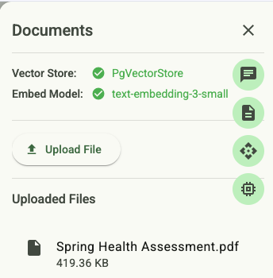
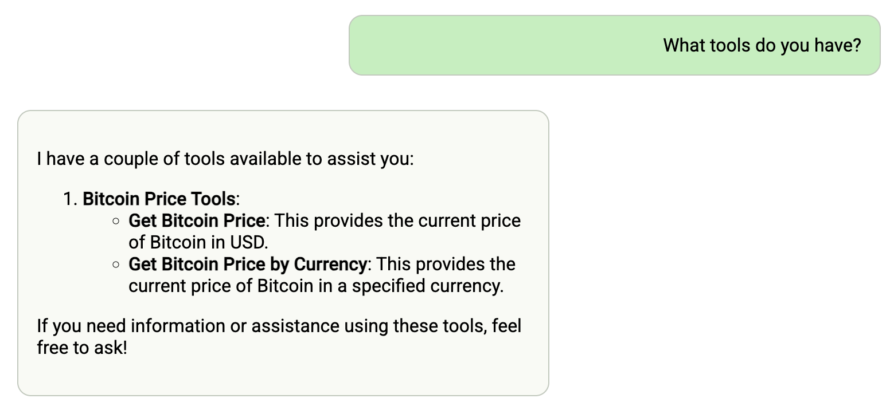

# CF-MCP-Client: AI Chat Client for Cloud Foundry

## Overview

CF-MCP-Client is a Spring chatbot application that can be deployed to Cloud Foundry and consume platform AI services. It's built with Spring AI and leverages the Model Context Protocol (MCP) and memGPT to provide advanced capabilities:

## Prerequisites

- Java 21 or higher
- Maven 3.8+
- Access to a Cloud Foundry Foundation with the GenAI tile or other LLM services
- Developer access to your Cloud Foundry environment

## Deploying to Cloud Foundry

### Preparing the Application

1. Build the application package:

```bash
mvn clean package
```

2. Push the application to Cloud Foundry:

```bash
cf push
```

### Binding to LLM Models

1. Create a service instance that provides chat LLM capabilities:

```bash
cf create-service genai [plan-name] chat-llm
```

2. Bind the service to your application:

```bash
cf bind-service ai-tool-chat chat-llm
```

3. Restart your application to apply the binding:

```bash
cf restart ai-tool-chat
```

Now your chatbot will use the LLM to respond to chat requests.


### Binding to Vector Databases

1. Create a service instance that provides embedding LLM capabilities

```bash
cf create-service genai [plan-name] embedding-llm 
```

2. Create a Postgres service instance to use as a vector database

```bash
cf create-service postgres on-demand-postgres-db vector-db
```

3. Bind the services to your application

```bash
cf bind-service ai-tool-chat embedding-llm 
cf bind-service ai-tool-chat vector-db
```

4. Restart your application to apply the binding:

```bash
cf restart ai-tool-chat
```

5. Click on the document tool on the right-side of the screen, and upload a .PDF File


Now your chatbot will respond to queries about the uploaded document


### Binding to MCP Agents

Model Context Protocol (MCP) servers are lightweight programs that expose specific capabilities to AI models through a standardized interface. These servers act as bridges between LLMs and external tools, data sources, or services, allowing your AI application to perform actions like searching databases, accessing files, or calling external APIs without complex custom integrations.

1. Create a user-provided service that provides the URL for an existing MCP server:

```bash
cf cups mcp-server -p '{"mcpServiceURL":"https://your-mcp-server.example.com"}'
```

2. Bind the MCP service to your application:

```bash
cf bind-service ai-tool-chat mcp-server
```

3. Restart your application:

```bash
cf restart ai-tool-chat
```

Your chatbot will now register with the MCP agent, and the LLM will be able to invoke the agent's capabilities when responding to chat requests.



### Using a Vector Store for Conversation Memory

If you are bound to a vector database and an embedding model, then your chat memory will persist across application restarts and scaling.

1. Follow the instructions above in **Binding to Vector Databases**


